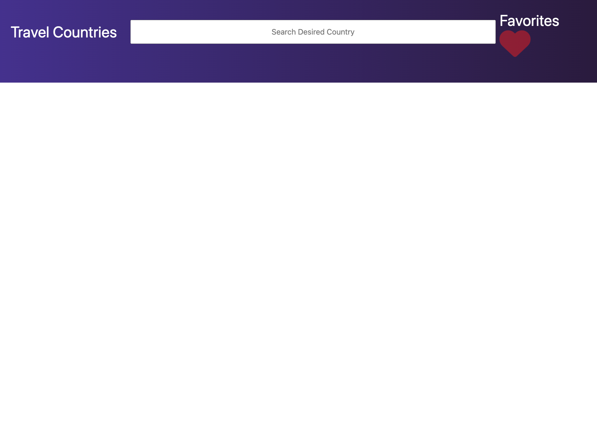

# countries-app
A county holiday information search app.

## Description
A search app that allows a user to search potential holiday destination countries and view important imformation of the country they have searched. Displayed information includes population, currency as well as weather and other useful information.

### Installation
Click on the following link to access the URL:
<!-- Link to URL page -->

### Usage
Once the URL has loaded this is what you will see: 
 
A user can then enter in a destination of choice by typing in the country they wish to search and push enter. 
This will bring up information about the country searched. 
The user will then be able to save the country searched as a favorite, which will then display the next time they open the URL using the local storage function.

### Credits
EdX front end web development course. 
[Rest Countries API](https://restcountries.com/) 
[Open Weather Map API](https://openweathermap.org/api)
<!-- Add APIs used as well as any links -->

### License
MIT License

Copyright (c) [2023] [Alex Christakou, Patricia Garcia, Mikael Cope]

Permission is hereby granted, free of charge, to any person obtaining a copy
of this software and associated documentation files (the "Software"), to deal
in the Software without restriction, including without limitation the rights
to use, copy, modify, merge, publish, distribute, sublicense, and/or sell
copies of the Software, and to permit persons to whom the Software is
furnished to do so, subject to the following conditions:

The above copyright notice and this permission notice shall be included in all
copies or substantial portions of the Software.

THE SOFTWARE IS PROVIDED "AS IS", WITHOUT WARRANTY OF ANY KIND, EXPRESS OR
IMPLIED, INCLUDING BUT NOT LIMITED TO THE WARRANTIES OF MERCHANTABILITY,
FITNESS FOR A PARTICULAR PURPOSE AND NONINFRINGEMENT. IN NO EVENT SHALL THE
AUTHORS OR COPYRIGHT HOLDERS BE LIABLE FOR ANY CLAIM, DAMAGES OR OTHER
LIABILITY, WHETHER IN AN ACTION OF CONTRACT, TORT OR OTHERWISE, ARISING FROM,
OUT OF OR IN CONNECTION WITH THE SOFTWARE OR THE USE OR OTHER DEALINGS IN THE
SOFTWARE.